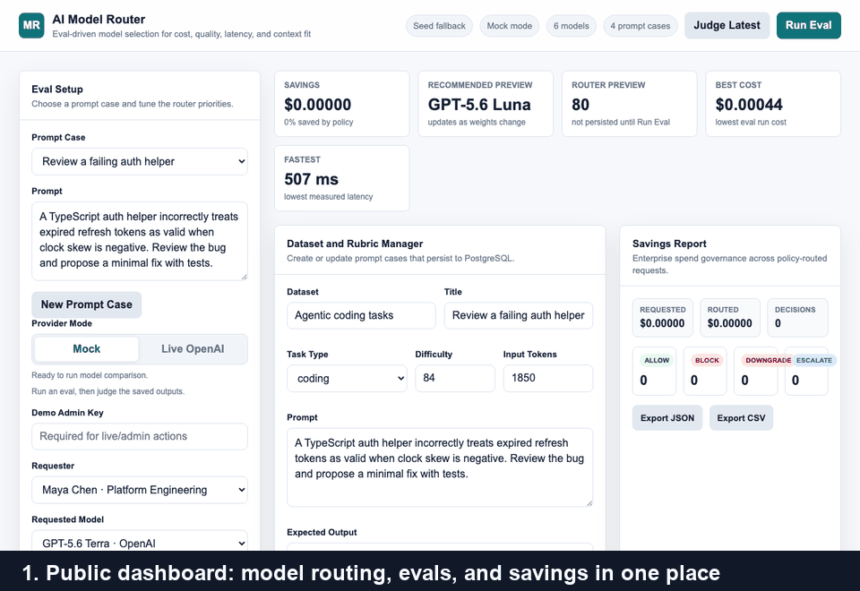
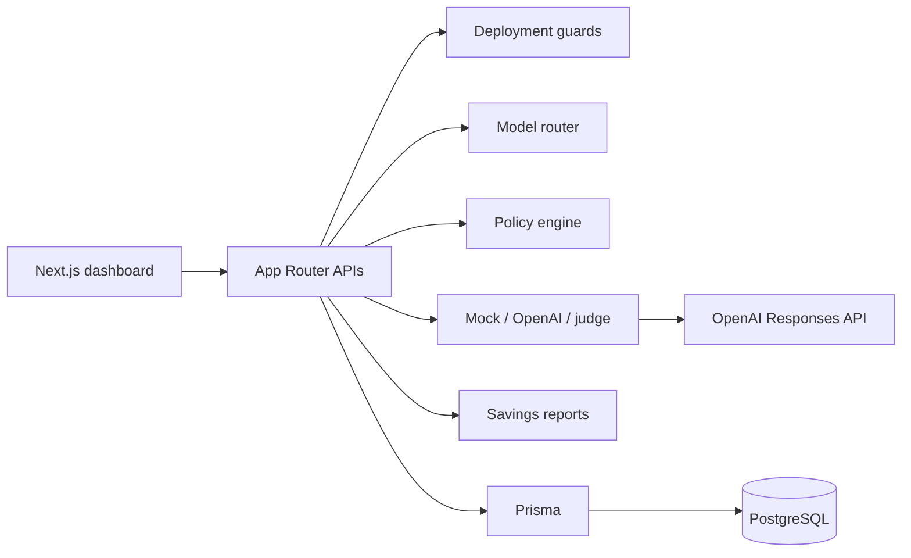

# Enterprise AI Model Router

[](https://github.com/Rohanasudani/enterprise-ai-model-router/actions/workflows/ci.yml)
[](https://enterprise-ai-model-router.vercel.app)
[](https://nextjs.org/)
[](https://www.typescriptlang.org/)
[](https://www.prisma.io/)

An explainable control plane for evaluating and routing LLM requests. The application
combines model quality, estimated cost, latency, context fit, task type, team budget,
and usage policy to choose a model or block a request.

[Open the public demo](https://enterprise-ai-model-router.vercel.app)



## Core Workflow

1. Select or create a prompt case with an expected behavior and scoring rubric.
2. Run a deterministic mock evaluation or a guarded live OpenAI evaluation.
3. Compare output quality, latency, token usage, and estimated cost.
4. Optionally replace heuristic scores with structured LLM-as-judge results.
5. Route an enterprise request through model scoring, budget, and policy checks.
6. Review the persisted decision history and export a savings estimate.

## Capabilities

- weighted model routing across quality, cost, latency, and context fit
- separate policy decisions for `allow`, `block`, `downgrade`, and `escalate`
- deterministic mock evaluations for a no-credit public demo
- guarded OpenAI Responses API integration
- structured LLM-as-judge scoring against stored rubrics
- PostgreSQL history for prompts, runs, results, routing, teams, and policy audits
- JSON and CSV savings reports
- request validation, admin gates, rate limits, and production-safe errors
- unit, production-build, and Playwright coverage in GitHub Actions

## Architecture



The router and policy engine deliberately answer different questions. The router ranks
candidate models for a prompt and set of results. The policy engine decides whether the
request should be funded, downgraded, escalated, or blocked.

See [docs/architecture.md](docs/architecture.md) for module and request-flow details.

## Run Locally

Prerequisites: Node.js 24+, Docker Desktop, and npm.

```bash
git clone https://github.com/Rohanasudani/enterprise-ai-model-router.git
cd enterprise-ai-model-router
npm install
cp .env.example .env
docker compose up -d
npm run db:migrate
npm run db:seed
npm run dev
```

Open `http://localhost:3000`.

Mock mode does not require an OpenAI key. For a private live evaluation, set
`OPENAI_API_KEY`, `LIVE_MODE_ENABLED=true`, and a strong `DEMO_ADMIN_KEY` in the local
environment. Do not expose the admin key through a `NEXT_PUBLIC_` variable.

## Environment

| Variable | Purpose | Public demo default |
| --- | --- | --- |
| `DATABASE_URL` | PostgreSQL connection string | required |
| `LIVE_MODE_ENABLED` | permits provider-backed eval and judge paths | `false` |
| `OPENAI_API_KEY` | server-side provider credential | unset |
| `OPENAI_JUDGE_MODEL` | model used for rubric scoring | `gpt-4.1-mini` |
| `DEMO_ADMIN_KEY` | protects live and mutating production actions | required |

## Evaluation Boundaries

The public mock path is a deterministic product demonstration. Its outputs, token
counts, latency, and scores are synthetic and must not be interpreted as provider
benchmarks. Live evaluations call configured OpenAI models, but their initial scores
are still heuristic until the judge action records a rubric-based score.

Routing uses the results and model prices available to the application at that moment.
Savings reports are counterfactual estimates, not reconciled provider invoices. The
keyword policy classifier demonstrates the policy flow; it is not a production content
moderation or data-loss-prevention system.

See [docs/evaluation.md](docs/evaluation.md) for the scoring and reporting methodology.

## Production Safety

The Vercel deployment runs in public mock mode. Live calls and mutating production
actions require server-side configuration and the admin header. Public mock evals can
return previews without persisting new rows.

This is a controlled public demo, not a complete multi-tenant security boundary. A
company deployment would still need real authentication, RBAC, tenant isolation,
shared-store rate limiting, provider spend controls, and audit retention policies.

See [docs/security.md](docs/security.md) for the threat model and limitations.

## Verification

```bash
npm run lint
npm test
npm run build
npm run test:e2e
npm audit --audit-level=moderate
```

CI starts PostgreSQL 16, applies migrations, seeds fixtures, runs lint and unit tests,
builds the production application, and executes the Chromium E2E suite.

## API Surface

| Route | Purpose |
| --- | --- |
| `POST /api/eval-runs` | run mock or live evaluations |
| `POST /api/judge-results` | judge stored eval results |
| `GET/POST /api/prompt-cases` | list or create prompt cases |
| `POST /api/policy-decisions` | classify and route requests |
| `GET /api/reports/savings` | return JSON or CSV savings reports |
| `POST /api/bootstrap` | seed protected demo data |

## Documentation

- [Design](DESIGN.md)
- [Architecture](docs/architecture.md)
- [Evaluation](docs/evaluation.md)
- [Deployment](docs/deployment.md)
- [Security](docs/security.md)

## Current Work

- shared, durable rate limiting for multi-instance deployments
- authenticated workspaces and tenant-scoped data access
- versioned model pricing, prompts, and rubrics
- repeated provider evaluations with calibration and drift tracking
- additional provider adapters behind the existing provider boundary
